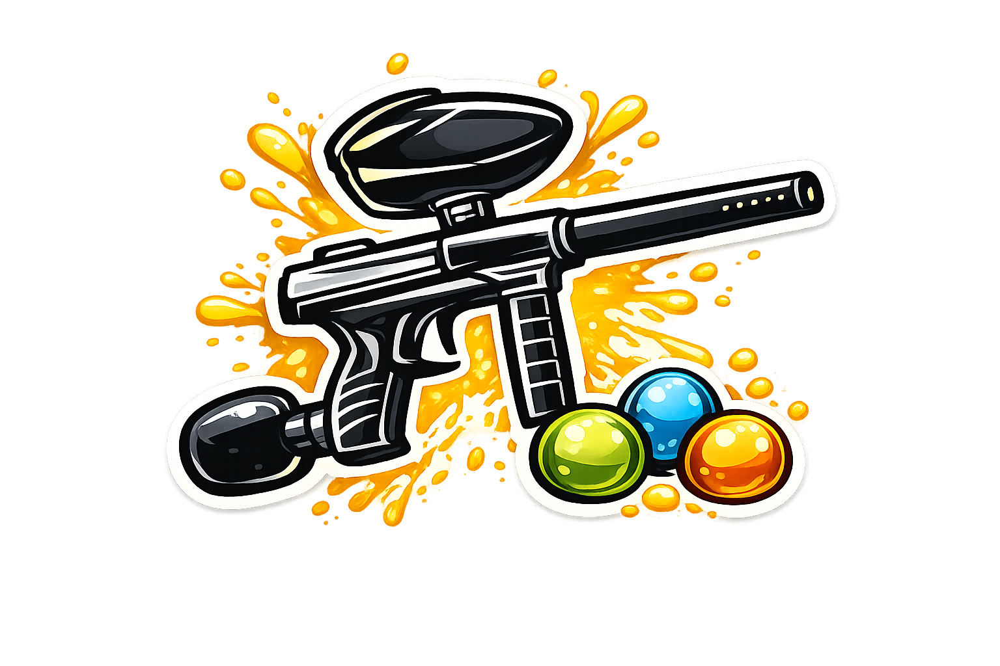

# 🏹 Parque Aventura — Sistema de Pontuação

Uma experiência web **imersiva** para gerir pontuações de **Arco e Flecha** e **Paintball** no Parque Aventura. Tema _Wilderness Premium_: atmosfera de floresta animada, alvo interativo, pódio com confetti e efeitos sonoros — tudo sem dependências e pronto para GitHub Pages.

 

## ✨ Destaques da experiência

- **Cenário atmosférico vivo** — céu ao entardecer, sol pulsante, silhuetas de montanhas e árvores em profundidade, nevoeiro à deriva e **pirilampos** gerados em canvas.
- **Visual próprio por jogo** — Arco e Flecha usa um **alvo de anéis** onde cada flecha aterra no anel certo; Paintball usa um **painel de furos em paus** (30/20/10/8/6) onde a tinta acerta no furo correspondente.
- **Botões de pontuação por tiers** — cores graduadas do ouro (máximo) ao mate (mínimo), mais botão "Fora".
- **Placar em tempo real** — barras de progresso, coroa 👑 para o líder e destaque do jogador atual.
- **Resultados cinematográficos** — pódio 3D com medalhas, **confetti**, classificação completa, conquistas e estatísticas individuais detalhadas.
- **Cartão de foto partilhável (estilo Strava)** — tira/escolhe uma foto e as pontuações de **todos os jogadores** são sobrepostas num cartão de marca; guardar ou partilhar (Web Share API). Também funciona "sem foto".
- **Som sintetizado** (Web Audio, sem ficheiros) — _thwack_ para arco, _splat_ para paintball, fanfarra no vencedor. Botão para silenciar.
- **Feedback tátil** (vibração) em dispositivos móveis.
- **5 idiomas** — 🇵🇹 Português · 🇬🇧 English · 🇫🇷 Français · 🇩🇪 Deutsch · 🇮🇹 Italiano.

## 🎯 Jogos

| Jogo | Pontuações | Rondas por defeito |
|------|------------|--------------------|
| **Arco e Flecha** | 10 → 1 + Fora | 20 |
| **Paintball** | 30, 20, 10, 8, 6 + Fora | 40 |

Todos os jogadores jogam em cada ronda; o total, precisão e melhor ronda são calculados ao vivo.

## 🎮 Como usar

1. **Escolhe a atividade** (Arco e Flecha ou Paintball) e o idioma.
2. **Adiciona os jogadores** e define o número de rondas.
3. **Pontua** cada disparo — o placar e o alvo atualizam em tempo real.
4. **Vê os resultados** — pódio, conquistas e estatísticas individuais.

## 🎨 Design

- **Mobile-first** e totalmente responsivo (telemóvel → desktop).
- **Glassmorphism** sobre cenário natural, tipografia _Bricolage Grotesque_ + _Inter_.
- **Acessível** — foco por teclado, `prefers-reduced-motion`, contraste elevado.
- **PWA** — instalável, com `manifest.json` e cor de tema florestal.

## 🚀 Tecnologias

HTML5 · CSS3 (variáveis, grid, canvas) · JavaScript ES6+ · Web Audio API · SVG — **zero dependências de build**.

## 📁 Estrutura

```
parque-aventura/
├── index.html      # Estrutura e ecrãs
├── styles.css      # Design system "Wilderness Premium"
├── script.js       # Motor de jogo, i18n, áudio, confetti, partículas
├── manifest.json   # PWA
├── logo.png · Tiro ao Arco.png · Paintball.png
└── README.md
```

## 🖥️ Correr localmente

```bash
# Abrir index.html diretamente, ou servir:
python3 -m http.server 8000
# → http://localhost:8000
```

---

Feito com 💚 para o Parque Aventura.
